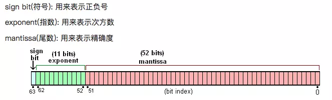

## JavaScript Number

在 js 中:

```js
0.1+0.2=0.30000000000000004
```

### 原理

1. Number 数据类型在 JS 中是以二进制浮点数存储的，并用科学计数法表示
2. 把这个数值通过 IEEE 754 标准表示成真正会在计算机中存储的值



也就是说一个 Number 类型的数字在内存中会被表示成：**_s _ m _ 2^e_** 这样的格式。

在 ES 规范中规定 e 的范围在-1074 ~ 971，而 m 最大能表示的最大数是 52 个 1，最小能表示的是 1

二进制的第一位有效数字必定是 1，因此这个 1 不会被存储，可以节省一个存储位，因此尾数部分可以存储的范围是 1 ~ 2^(52+1)

因此 umber 能表示的最大数字绝对值范围是 2^-1074 ~ 2^(53+971)

### 精度丢失

计算机中存储小数是先转换成二进制进行存储的，我们来看一下 0.1 和 0.2 转换成二进制的结果：

```js
(0.1)10 => (00011001100110011001(1001)...)2

(0.2)10 => (00110011001100110011(0011)...)2
```

可以发现，0.1 和 0.2 转成二进制之后都是一个无限循环的数，前面提到尾数位只能存储最多 53 位有效数字，这时候就必须来进行四舍五入了，而这个取舍的规则就是在 IEEE 754 中定义的，0.1 最终能被存储的有效数字是

```js

0001(1001)(1001)(1001)(1001)(1001)(1001)(1001)(1001)(1001)(1001)(1001)(1001)101
+
(0011)(0011)(0011)(0011)(0011)(0011)(0011)(0011)(0011)(0011)(0011)(0011)(0011)01
=
0100(1100)(1100)(1100)(1100)(1100)(1100)(1100)(1100)(1100)(1100)(1100)(1100)111
```

> 这里注意，53 位的存储位指的是能存 53 位有效数字，因此前置的 0 不算，要往后再取到 53 位有效数字为止

最终的这个二进制数转成十进制就是 0.30000000000000004（不信的话可以找一个在线进制转换工具试一下。

> 用一句话来概括就是，计算机中用二进制来存储小数，而大部分小数转成二进制之后都是无限循环的值，因此存在取舍问题，也就是精度丢失。
